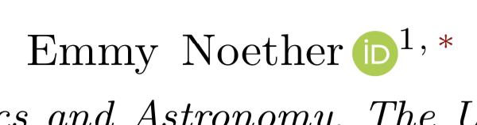

# orcidlink-LaTeX-command
LaTeX style file to add a macro for inserting a linked ORCiD logo

This LaTeX style file just defines a single macro, `\orcidlink`.  The code is from [this TeX.SE answer](https://tex.stackexchange.com/a/445583/34063).  My only contribution was wrapping it into a style file.

Usage
-----

Just copy [orcidlink.sty](orcidlink.sty) into the same directory as your LaTeX source.  Then in your preamble, add:
```latex
\usepackage{orcidlink}
```
When you want to insert the hyperlinked ORCiD logo, use `\orcidlink{0000-0000-0000-0000}`, replacing the digits with your ORCiD (just the digits, not your whole URL).  This is most common in the author list.  For example, in a revtex article, you would write e.g.
```latex
\author{Emmy Noether\,\orcidlink{0000-0000-0000-0000}}
...
```
This will appear as a clickable hyperlink, and will look like this:

